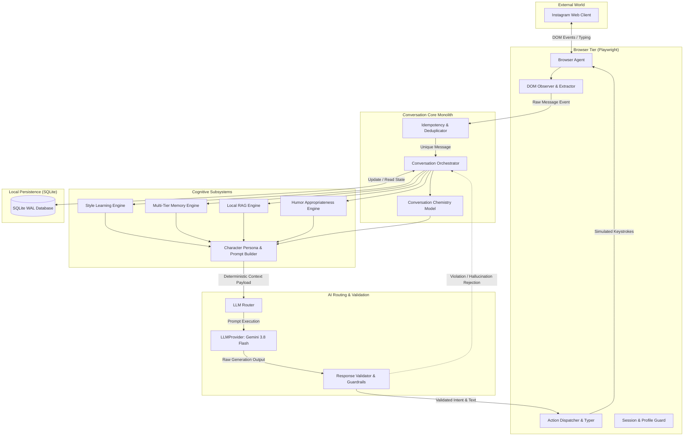
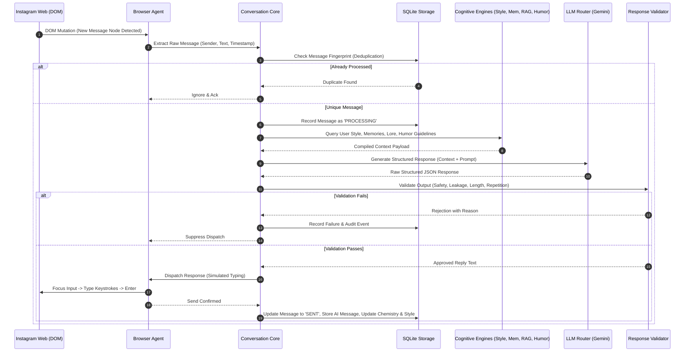

# System Architecture Specification

## 1. Executive Summary & Core Mission
The **Fictional AI Character Instagram Browser Agent** is a self-hosted, autonomous software system engineered to maintain a compelling, consistent, and humorously distinctive conversational persona across Instagram Direct Messages (DMs). The system operates exclusively by observing and driving the standard Instagram Web client via Playwright, strictly respecting platform boundaries and executing zero direct private or public Meta API calls.

---

## 2. High-Level System Architecture



---

## 3. Strict AI / Runtime Security Boundary

The Large Language Model (LLM) is treated strictly as an **untrusted offline cognitive planner and content synthesizer**. It possesses zero operational authority.

```
       +-------------------------------------------------------------+
       |                         AI Boundary                         |
       |  LLM Context Window: Read-only, sanitized text prompts     |
       |  LLM Output: Strictly structured JSON schemas               |
       +-------------------------------------------------------------+
                                      │
                                      ▼
             [ Response Validator & Tool Permission Checker ]
                                      │
                       ┌──────────────┴──────────────┐
                       │ Passes Policy Checks        │ Fails Safety / Bounds
                       ▼                             ▼
        +----------------------------+        +----------------------------+
        | Runtime Controller         |        | Halt Action & Log Alert    |
        | - Types text into DOM      |        | - No DOM manipulation      |
        | - Commits DB transaction   |        | - Increment audit counters |
        +----------------------------+        +----------------------------+
```

### Absolute Operational Invariants:
1. **No Browser Objects to LLM**: The LLM never receives Playwright handles, `Page` references, DOM pointers, cookies, session storage tokens, or credentials.
2. **No Execution of Arbitrary Code**: The LLM cannot emit executable shell scripts, SQL queries, or filesystem operations.
3. **Structured Intents Only**: The LLM outputs an immutable typed structure:
   ```json
   {
     "intent": "REPLY",
     "reply_text": "...",
     "internal_reasoning": "...",
     "humor_style_applied": "dry_sarcasm",
     "callback_referenced": null
   }
   ```
4. **Validation Precondition**: The `ResponseValidator` strictly vets `reply_text` before any DOM interaction.

---

## 4. Subsystem Decomposition & Component Responsibilities

### 4.1 Browser Tier (`app/browser/`)
* **`session.py`**: Manages the persistent Chromium user data directory (`data/browser_profile`). Enforces operator interactive login mode (`--setup-login`) so 2FA and human verification are completed cleanly.
* **`selectors.py`**: Centralized selector registry for Instagram Web DMs (message lists, input fields, unread badges) with versioned fallbacks.
* **`instagram.py`**: Orchestrates DOM observation, message extraction, typing cadence simulation, and diagnostic screenshot capture upon errors.

### 4.2 Conversation Core (`app/conversation/`)
* **`manager.py`**: The central coordinator. Implements the complete message lifecycle: `Receive -> Deduplicate -> Context Aggregation -> LLM Query -> Validation -> Browser Dispatch -> State Persistence`.
* **`state.py`**: Tracks thread processing state, retry attempts, pending dispatches, and backoff states.
* **`chemistry.py`**: Evaluates continuous interaction dynamics:
  * `familiarity`: Rate of historical interaction and continuity ($0.0 \to 1.0$).
  * `playfulness`: Propensity for banter and witty teasing ($0.0 \to 1.0$).
  * `sarcasm_tolerance`: Observed user receptivity to irony and sarcasm ($0.0 \to 1.0$).
  * `trust`: Depth of shared historical facts ($0.0 \to 1.0$).

### 4.3 Memory Engine (`app/memory/`)
* **Short-Term Memory**: Sliding window of recent conversational turns (default: last 10 messages).
* **Long-Term Factual Memory**: User-specific facts extracted asynchronously (e.g. "User lives in Berlin", "User is learning Rust").
* **Preference Memory**: User likes, dislikes, conversational triggers, and boundaries.
* **Relationship / Callback Memory**: Tracks running jokes, recurring topics, and mutual references with recency and punchline metadata.

### 4.4 Local RAG Engine (`app/rag/`)
* **`embeddings.py`**: Local ONNX Runtime execution via `fastembed` (`bge-small-en-v1.5`, 384 dimensions). Zero external network calls for vector generation.
* **`chunker.py`**: Markdown and text chunking with metadata preservation (lore, backstory, custom operator files).
* **`indexer.py` / `retriever.py`**: Stores vector embeddings in SQLite BLOB columns. Executes vectorized cosine similarity across chunks.

### 4.5 Humor Engine (`app/humor/`)
* **`engine.py`**: Evaluates incoming message sentiment, topic sensitivity, and user sarcasm tolerance before approving humor generation.
* **`retrieval.py`**: Fetches curated humor exemplars and ongoing callbacks to inject subtle stylistic guidance.

### 4.6 User Style Learning Engine (`app/memory/style.py`)
* Computes stylometric distributions per user: average sentence length, capitalization habits, punctuation patterns, slang markers, Hinglish/vernacular mixing, and emoji density.
* Computes statistical confidence scores based on evidence count ($N$) and exponential recency decay.

### 4.7 AI Engine & LLM Abstraction (`app/ai/`)
* **`provider.py`**: Abstract base class `LLMProvider` decoupling the application from specific SDKs.
* **`gemini.py`**: Concrete implementation utilizing Gemini 3.8 Flash with structured schema constraints.
* **`prompts.py`**: Deterministic prompt builder joining Persona + Style + Memory + RAG + Context.
* **`validator.py`**: Guardrail filter verifying token bounds, absence of prompt leakage, repetition checks, and tone safety.

### 4.8 Persistence Layer (`app/storage/`)
* Single-file SQLite database with Write-Ahead Logging (`PRAGMA journal_mode = WAL;`) and enforced Foreign Key constraints (`PRAGMA foreign_keys = ON;`).
* Thread-safe connection management and idempotent transactional repositories.

---

## 5. End-to-End Execution Sequence



---

## 6. Failure Modes & Circuit Breakers

1. **Bot Challenge / Checkpoint**:
   * If Instagram renders a checkpoint, CAPTCHA, or temporary action block modal:
   * Action: The browser agent triggers `CRITICAL_CHALLENGE_DETECTED`, saves full DOM snapshot and screenshot to `logs/diagnostics/`, safely closes the browser, and triggers an operator notification. Under zero circumstances is circumvention attempted.
2. **LLM Exhaustion / Rate Limit (HTTP 429 / 503)**:
   * Exponential backoff with jitter (max 3 retries). If retries exhaust, message state transitions to `FAILED_LLM` and execution gracefully suspends.
3. **Selector Drift**:
   * If known selectors fail to match the input box or message list, capture diagnostics and gracefully enter `DEGRADED_HALT` state to await selector definition update.
