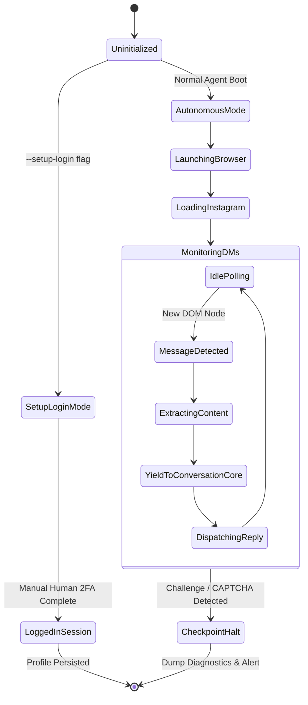

# Browser Agent & Playwright Integration Specification

## 1. Browser Architecture & Execution Model

The Browser Agent operates a persistent Chromium instance driven by `playwright.async_api`. It interacts with the live Instagram Web client exactly as a human user would, observing visual DOM state and dispatching keystrokes.



---

## 2. Persistent Profile & Authentication Protocol

### 2.1 Storage Layout
* The browser state is permanently persisted in a local directory:
  `data/browser_profile/` (strictly excluded in `.gitignore`).
* This stores IndexedDB, LocalStorage, and session cookies across restarts so authentication persists indefinitely without storing cleartext passwords.

### 2.2 Operator Interactive Setup (`--setup-login`)
To ensure complete compliance with anti-circumvention rules:
1. Operator invokes: `python -m app.main --setup-login`.
2. Browser launches in **headed mode** with viewport $1280 \times 800$.
3. Operator navigates to `https://www.instagram.com/direct/inbox/`, completes login and any required 2FA / device verification.
4. Operator presses Enter in the console. The session is flushed to disk and the browser closes cleanly.
5. Autonomous runs launch headless (or headed if configured) using the verified session.

---

## 3. DOM Selectors & Resilient Fallback Map

Instagram Web utilizes obfuscated and periodically changing CSS class names. The browser agent uses a tiered selector map prioritizing accessible ARIA attributes and robust structural paths:

```python
# app/browser/selectors.py

SELECTORS = {
    # Message List & Container
    "chat_container": [
        "div[role='main'] div[role='grid']",
        "div[role='main'] section",
        "div[aria-label='Messages']",
    ],
    "message_rows": [
        "div[role='row']",
        "div[role='listitem']",
        "div[data-testid='message-row']",
    ],
    "message_text": [
        "div[dir='auto']",
        "span[dir='auto']",
    ],

    # Input Box
    "message_input": [
        "div[role='textbox'][contenteditable='true']",
        "div[aria-label='Message']",
        "textarea[placeholder='Message...']",
    ],

    # Send Action
    "send_button": [
        "button:has-text('Send')",
        "div[role='button']:has-text('Send')",
    ],

    # Security Checkpoint / CAPTCHA Traps (For immediate halt)
    "checkpoint_indicators": [
        "form#checkpointSubmitForm",
        "div:has-text('Suspicious Activity')",
        "div:has-text('Confirm your info')",
        "div:has-text('Help us confirm it\\'s you')",
        "iframe[src*='recaptcha']",
        "iframe[src*='hcaptcha']",
    ]
}
```

---

## 4. Message Extraction & DOM Virtualization Handling

Instagram Web virtualizes long chat threads, keeping only proximate messages in the DOM tree.
1. **Extraction Algorithm**:
   * Inspect the bottom $N=5$ elements matching `message_rows`.
   * For each element, determine sender type:
     * If element alignment or CSS attributes indicate right-aligned/character-colored bubble $\to$ `CHARACTER`.
     * If left-aligned $\to$ `USER`.
   * Extract inner text and clean whitespace.
2. **Deterministic Fingerprint Calculation**:
   $$\text{Fingerprint} = \text{SHA256}(\text{thread\_id} + \text{sender} + \text{text} + \text{hour\_bucket})$$
3. Query SQLite `messages` table. If fingerprint already exists $\to$ skip immediately.

---

## 5. Human-Like Keystroke Cadence Simulation

Automated bots paste text instantaneously, triggering heuristic platform detection. The agent dispatches text with simulated human typing kinetics:

```python
async def send_message_humanlike(page: Page, text: str):
    input_box = await page.wait_for_selector(SELECTORS["message_input"][0])
    await input_box.click()
    await asyncio.sleep(random.uniform(0.3, 0.7))
    
    for char in text:
        await input_box.type(char, delay=random.uniform(35, 85))  # milliseconds
        # Occasional micro-pause on punctuation
        if char in [".", ",", "!", "?"]:
            await asyncio.sleep(random.uniform(0.15, 0.35))
            
    await asyncio.sleep(random.uniform(0.4, 0.9))
    await page.keyboard.press("Enter")
```

---

## 6. Emergency Halt & Diagnostic Protocol

If any selector from `checkpoint_indicators` matches at any time:
1. **Immediate Execution Abort**: Cancel active typing and close current page context.
2. **Diagnostic Dump**:
   * Generate high-res screenshot: `logs/diagnostics/challenge_screenshot_<timestamp>.png`.
   * Dump complete page DOM HTML: `logs/diagnostics/challenge_dom_<timestamp>.html`.
3. **Audit Event**: Insert `CRITICAL` record into `audit_events` with screenshot paths.
4. **Halt System**: Set system state to `HALTED_OPERATOR_REQUIRED` and alert operator in console.
5. **No Automated Retries**: Never re-open the browser automatically upon challenge detection.
