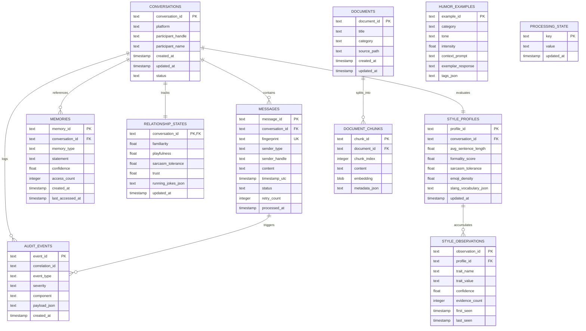

# Data Model & SQLite Database Schema

## 1. Overview & SQLite Engine Configuration

The application utilizes a single local SQLite database (`data/agent.db`). To achieve high concurrency, durability, and sub-millisecond query performance, the database connection must always be initialized with the following PRAGMA settings:

```sql
PRAGMA journal_mode = WAL;         -- Write-Ahead Logging for non-blocking reads/writes
PRAGMA synchronous = NORMAL;       -- Safe with WAL, improves disk I/O performance
PRAGMA foreign_keys = ON;          -- Strict relational referential integrity
PRAGMA temp_store = MEMORY;        -- Store temp tables and indices in RAM
PRAGMA cache_size = -64000;        -- 64MB memory page cache
PRAGMA busy_timeout = 5000;        -- Wait up to 5s on locked tables before raising error
```

---

## 2. Entity-Relationship Diagram



---

## 3. Detailed Table Specifications & DDL

### 3.1 `conversations`
Represents an ongoing interaction thread with an Instagram user.
```sql
CREATE TABLE IF NOT EXISTS conversations (
    conversation_id TEXT PRIMARY KEY,          -- Instagram thread ID or hashed recipient handle
    platform TEXT NOT NULL DEFAULT 'instagram',
    participant_handle TEXT NOT NULL,         -- e.g. @janedoe
    participant_name TEXT,                    -- Display name if visible in DOM
    status TEXT NOT NULL DEFAULT 'ACTIVE',     -- ACTIVE, MUTED, BLOCKED, ARCHIVED
    created_at TIMESTAMP NOT NULL DEFAULT CURRENT_TIMESTAMP,
    updated_at TIMESTAMP NOT NULL DEFAULT CURRENT_TIMESTAMP
);

CREATE INDEX IF NOT EXISTS idx_conversations_handle ON conversations(participant_handle);
```

### 3.2 `messages`
Tracks all inbound and outbound conversational turns with idempotency controls.
```sql
CREATE TABLE IF NOT EXISTS messages (
    message_id TEXT PRIMARY KEY,               -- UUID4 or synthesized deterministic ID
    conversation_id TEXT NOT NULL,
    fingerprint TEXT UNIQUE NOT NULL,          -- SHA256(conv_id + sender + text + hour_bucket)
    sender_type TEXT NOT NULL,                 -- 'USER' or 'CHARACTER'
    sender_handle TEXT NOT NULL,
    content TEXT NOT NULL,
    timestamp_utc TIMESTAMP NOT NULL DEFAULT CURRENT_TIMESTAMP,
    status TEXT NOT NULL DEFAULT 'RECEIVED',   -- 'RECEIVED', 'PROCESSING', 'SENT', 'FAILED', 'IGNORED'
    retry_count INTEGER NOT NULL DEFAULT 0,
    processed_at TIMESTAMP,
    FOREIGN KEY (conversation_id) REFERENCES conversations(conversation_id) ON DELETE CASCADE
);

CREATE INDEX IF NOT EXISTS idx_messages_conversation ON messages(conversation_id, timestamp_utc DESC);
CREATE INDEX IF NOT EXISTS idx_messages_fingerprint ON messages(fingerprint);
CREATE INDEX IF NOT EXISTS idx_messages_status ON messages(status);
```

### 3.3 `memories`
Stores extracted facts, preferences, and long-term context about the user.
```sql
CREATE TABLE IF NOT EXISTS memories (
    memory_id TEXT PRIMARY KEY,
    conversation_id TEXT NOT NULL,
    memory_type TEXT NOT NULL,                 -- 'FACT', 'PREFERENCE', 'RUNNING_JOKE', 'TOPIC'
    statement TEXT NOT NULL,                   -- e.g. "User lives in Seattle and hates coffee"
    confidence REAL NOT NULL DEFAULT 1.0,     -- 0.0 to 1.0
    access_count INTEGER NOT NULL DEFAULT 0,
    created_at TIMESTAMP NOT NULL DEFAULT CURRENT_TIMESTAMP,
    last_accessed_at TIMESTAMP NOT NULL DEFAULT CURRENT_TIMESTAMP,
    FOREIGN KEY (conversation_id) REFERENCES conversations(conversation_id) ON DELETE CASCADE
);

CREATE INDEX IF NOT EXISTS idx_memories_lookup ON memories(conversation_id, memory_type);
```

### 3.4 `relationship_states`
Maintains the behavioral chemistry dynamics for each conversation.
```sql
CREATE TABLE IF NOT EXISTS relationship_states (
    conversation_id TEXT PRIMARY KEY,
    familiarity REAL NOT NULL DEFAULT 0.1,     -- 0.0 (stranger) to 1.0 (intimate friend)
    playfulness REAL NOT NULL DEFAULT 0.5,     -- 0.0 (serious) to 1.0 (constant banter)
    sarcasm_tolerance REAL NOT NULL DEFAULT 0.3, -- Inferred user tolerance for sarcasm
    trust REAL NOT NULL DEFAULT 0.2,           -- Conversational depth and safety
    running_jokes_json TEXT DEFAULT '[]',      -- List of active callback descriptors
    updated_at TIMESTAMP NOT NULL DEFAULT CURRENT_TIMESTAMP,
    FOREIGN KEY (conversation_id) REFERENCES conversations(conversation_id) ON DELETE CASCADE
);
```

### 3.5 `style_profiles` & `style_observations`
Tracks stylometric trends and evidence-backed communication preferences.
```sql
CREATE TABLE IF NOT EXISTS style_profiles (
    profile_id TEXT PRIMARY KEY,
    conversation_id TEXT UNIQUE NOT NULL,
    avg_sentence_length REAL DEFAULT 8.0,
    formality_score REAL DEFAULT 0.2,          -- 0.0 (casual/slang) to 1.0 (academic)
    emoji_density REAL DEFAULT 0.1,            -- Emojis per 10 words
    slang_vocabulary_json TEXT DEFAULT '{}',   -- Map of observed slang words to counts
    updated_at TIMESTAMP NOT NULL DEFAULT CURRENT_TIMESTAMP,
    FOREIGN KEY (conversation_id) REFERENCES conversations(conversation_id) ON DELETE CASCADE
);

CREATE TABLE IF NOT EXISTS style_observations (
    observation_id TEXT PRIMARY KEY,
    profile_id TEXT NOT NULL,
    trait_name TEXT NOT NULL,                  -- 'sentence_length', 'slang_usage', 'hinglish', etc.
    trait_value TEXT NOT NULL,                 -- e.g. 'bro', 'low_capitalization'
    confidence REAL NOT NULL DEFAULT 0.2,      -- Calibrated by count and consistency
    evidence_count INTEGER NOT NULL DEFAULT 1,
    first_seen TIMESTAMP NOT NULL DEFAULT CURRENT_TIMESTAMP,
    last_seen TIMESTAMP NOT NULL DEFAULT CURRENT_TIMESTAMP,
    FOREIGN KEY (profile_id) REFERENCES style_profiles(profile_id) ON DELETE CASCADE
);

CREATE INDEX IF NOT EXISTS idx_style_obs_lookup ON style_observations(profile_id, trait_name);
```

### 3.6 `documents` & `document_chunks`
Supports the local RAG subsystem for character lore, world knowledge, and custom documents.
```sql
CREATE TABLE IF NOT EXISTS documents (
    document_id TEXT PRIMARY KEY,
    title TEXT NOT NULL,
    category TEXT NOT NULL,                    -- 'lore', 'backstory', 'operator_manual', 'general'
    source_path TEXT NOT NULL,
    created_at TIMESTAMP NOT NULL DEFAULT CURRENT_TIMESTAMP,
    updated_at TIMESTAMP NOT NULL DEFAULT CURRENT_TIMESTAMP
);

CREATE TABLE IF NOT EXISTS document_chunks (
    chunk_id TEXT PRIMARY KEY,
    document_id TEXT NOT NULL,
    chunk_index INTEGER NOT NULL,
    content TEXT NOT NULL,
    embedding BLOB NOT NULL,                   -- IEEE 754 float32 raw binary vector (384 * 4 = 1536 bytes)
    metadata_json TEXT DEFAULT '{}',
    FOREIGN KEY (document_id) REFERENCES documents(document_id) ON DELETE CASCADE
);

CREATE INDEX IF NOT EXISTS idx_chunks_document ON document_chunks(document_id);
```

### 3.7 `humor_examples`
Curated bank of persona-aligned humor and banter exemplars for context injection.
```sql
CREATE TABLE IF NOT EXISTS humor_examples (
    example_id TEXT PRIMARY KEY,
    category TEXT NOT NULL,                    -- 'dry_sarcasm', 'absurd', 'deadpan', 'playful_tease'
    tone TEXT NOT NULL,                        -- 'witty', 'cynical', 'philosophical', 'baffled'
    intensity REAL NOT NULL DEFAULT 0.5,       -- 0.0 to 1.0
    context_prompt TEXT NOT NULL,
    exemplar_response TEXT NOT NULL,
    tags_json TEXT DEFAULT '[]'
);

CREATE INDEX IF NOT EXISTS idx_humor_cat ON humor_examples(category, intensity);
```

### 3.8 `processing_state`
Key-value store for global checkpoints, last message scans, and browser state.
```sql
CREATE TABLE IF NOT EXISTS processing_state (
    key TEXT PRIMARY KEY,
    value TEXT NOT NULL,
    updated_at TIMESTAMP NOT NULL DEFAULT CURRENT_TIMESTAMP
);
```

### 3.9 `audit_events`
Immutable security and telemetry log for compliance, safety halts, and failure forensics.
```sql
CREATE TABLE IF NOT EXISTS audit_events (
    event_id TEXT PRIMARY KEY,
    correlation_id TEXT,
    event_type TEXT NOT NULL,                  -- 'CHALLENGE_HALT', 'VALIDATION_REJECT', 'LLM_RETRY'
    severity TEXT NOT NULL,                    -- 'INFO', 'WARNING', 'ERROR', 'CRITICAL'
    component TEXT NOT NULL,                   -- 'BROWSER', 'VALIDATOR', 'LLM', 'CORE'
    payload_json TEXT DEFAULT '{}',
    created_at TIMESTAMP NOT NULL DEFAULT CURRENT_TIMESTAMP
);

CREATE INDEX IF NOT EXISTS idx_audit_time ON audit_events(created_at DESC);
CREATE INDEX IF NOT EXISTS idx_audit_type ON audit_events(event_type, severity);
```

---

## 4. Routine, Availability & Life Simulation Schema

### 4.1 `routine_templates`
Stores the recurring weekly canonical schedule slots.
```sql
CREATE TABLE IF NOT EXISTS routine_templates (
    template_id TEXT PRIMARY KEY,
    day_of_week TEXT NOT NULL,                 -- 'monday', 'tuesday', ..., 'sunday'
    start_time TEXT NOT NULL,                  -- '07:45' (HH:MM format)
    end_time TEXT NOT NULL,                    -- '15:00'
    activity TEXT NOT NULL,                    -- 'school', 'rest', 'tuition', 'homework', 'sleep'
    location TEXT NOT NULL DEFAULT 'home',     -- 'school', 'tuition', 'home', 'commute'
    default_availability TEXT NOT NULL         -- 'AVAILABLE', 'BUSY', 'AT_SCHOOL', 'AT_TUITION', 'SLEEPING'
);
CREATE INDEX IF NOT EXISTS idx_routine_day ON routine_templates(day_of_week, start_time);
```

### 4.2 `availability_state`
Tracks real-time dynamic availability and away windows.
```sql
CREATE TABLE IF NOT EXISTS availability_state (
    character_id TEXT PRIMARY KEY,
    current_state TEXT NOT NULL,               -- 'AVAILABLE', 'BUSY', 'AT_SCHOOL', 'AT_TUITION', 'SLEEPING'
    current_activity TEXT NOT NULL,
    current_location TEXT NOT NULL,
    away_until TIMESTAMP,                      -- Enforced return timestamp
    warning_sent_for_activity TEXT,            -- ID of commitment for which departure warning was already sent
    updated_at TIMESTAMP NOT NULL DEFAULT CURRENT_TIMESTAMP
);
```

### 4.3 `academic_subjects` & `academic_exams`
Maintains fictional academic curriculum and test dates.
```sql
CREATE TABLE IF NOT EXISTS academic_subjects (
    subject_id TEXT PRIMARY KEY,
    subject_name TEXT NOT NULL,
    current_topic TEXT NOT NULL,
    updated_at TIMESTAMP NOT NULL DEFAULT CURRENT_TIMESTAMP
);

CREATE TABLE IF NOT EXISTS academic_exams (
    exam_id TEXT PRIMARY KEY,
    subject_id TEXT NOT NULL,
    topic TEXT NOT NULL,
    exam_date TEXT NOT NULL,                   -- 'YYYY-MM-DD'
    importance TEXT NOT NULL DEFAULT 'HIGH',   -- 'LOW', 'MEDIUM', 'HIGH'
    status TEXT NOT NULL DEFAULT 'SCHEDULED',  -- 'SCHEDULED', 'COMPLETED', 'CANCELLED'
    result_notes TEXT,
    FOREIGN KEY (subject_id) REFERENCES academic_subjects(subject_id) ON DELETE CASCADE
);
```

### 4.4 `homework_tasks`
Tracks pending school and tuition assignments.
```sql
CREATE TABLE IF NOT EXISTS homework_tasks (
    task_id TEXT PRIMARY KEY,
    subject_id TEXT NOT NULL,
    description TEXT NOT NULL,
    due_date TEXT NOT NULL,                    -- 'YYYY-MM-DD'
    status TEXT NOT NULL DEFAULT 'PENDING',    -- 'PENDING', 'IN_PROGRESS', 'DONE'
    priority TEXT NOT NULL DEFAULT 'MEDIUM',   -- 'LOW', 'MEDIUM', 'HIGH'
    created_at TIMESTAMP NOT NULL DEFAULT CURRENT_TIMESTAMP,
    FOREIGN KEY (subject_id) REFERENCES academic_subjects(subject_id) ON DELETE CASCADE
);
```

### 4.5 `special_events` & `life_events`
Tracks schedule overrides and daily spontaneous occurrences.
```sql
CREATE TABLE IF NOT EXISTS special_events (
    event_id TEXT PRIMARY KEY,
    event_date TEXT NOT NULL,                  -- 'YYYY-MM-DD'
    start_time TEXT,                           -- 'HH:MM' or NULL for all-day
    end_time TEXT,
    title TEXT NOT NULL,
    override_activity TEXT NOT NULL,
    override_availability TEXT NOT NULL,
    notes TEXT
);

CREATE TABLE IF NOT EXISTS life_events (
    event_id TEXT PRIMARY KEY,
    category TEXT NOT NULL,                    -- 'ACADEMIC', 'SOCIAL', 'DOMESTIC', 'MEDIA'
    headline TEXT NOT NULL,
    sentiment TEXT NOT NULL DEFAULT 'NEUTRAL',
    emotional_impact_json TEXT DEFAULT '{}',
    occurred_at TIMESTAMP NOT NULL DEFAULT CURRENT_TIMESTAMP,
    mentioned_in_chat INTEGER NOT NULL DEFAULT 0
);
CREATE INDEX IF NOT EXISTS idx_life_events_time ON life_events(occurred_at DESC);
```
