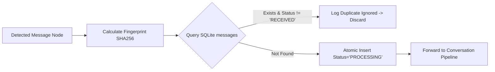

# Error Handling & Fault Recovery Architecture

## 1. System Error Taxonomy & Classification

Errors within the agent are categorized by severity and recovery strategy:

| Error Category | Error Code | Severity | Recovery Policy |
| :--- | :--- | :--- | :--- |
| **Transient Network / API** | `LLM_TIMEOUT`, `LLM_RATE_LIMIT_429` | WARNING | Bounded exponential backoff retry (max 3). |
| **API Fatal / Credential** | `LLM_AUTH_FAILURE_401`, `LLM_QUOTA_DEPLETED` | ERROR | Abort batch, transition to `PAUSED`, alert operator. |
| **Platform Challenge** | `IG_CHECKPOINT_DETECTED`, `IG_CAPTCHA_TRAP` | CRITICAL | **Immediate Halt**. Zero retry. Dump diagnostics. |
| **DOM Layout Drift** | `DOM_SELECTOR_NOT_FOUND`, `DOM_DETACHED` | ERROR | Capture screenshot/DOM, retry selector fallback; if exhausted $\to$ `DEGRADED_HALT`. |
| **Output Validation** | `VAL_SAFETY_VIOLATION`, `VAL_PROMPT_LEAK` | WARNING | Reject candidate, re-prompt once with penalty; if fails $\to$ `SUPPRESS_REPLY`. |
| **Database Contention** | `DB_BUSY_LOCKED` | WARNING | Automatic retry with backoff (busy timeout 5000ms). |

---

## 2. LLM Request Resilience & Exponential Backoff

```mermaid
flowchart TD
    REQ[Send Prompt to LLMProvider] --> RES{Response Status}
    RES -->|200 OK| SUCCESS[Return Structured Output]
    RES -->|429 Rate Limit / 5xx Server Error| RETRY_CHECK{Attempt < 3?}
    
    RETRY_CHECK -->|Yes| BACKOFF[Compute Exponential Backoff + Jitter]
    BACKOFF --> SLEEP[Wait T Seconds]
    SLEEP --> REQ
    
    RETRY_CHECK -->|No (Exhausted)| RECORD_FAIL[Record Status: FAILED_LLM]
    RECORD_FAIL --> AUDIT[Write Audit Event & Skip Reply]
```

### Backoff Calculation:
$$T_{\text{wait}} = \min\left(T_{\text{max}}, T_{\text{base}} \times 2^{\text{attempt}}\right) + \text{Uniform}(0, 1.0)$$
* $T_{\text{base}} = 2.0$ seconds.
* $T_{\text{max}} = 30.0$ seconds.
* Jitter ensures distributed retry spacing, preventing thundering herds.

---

## 3. Browser Crash & Disconnect Recovery

If the Playwright process terminates unexpectedly or encounters a detached target:
1. **Detection**: `playwright._impl._errors.TargetClosedError` or process exit signal.
2. **Action**:
   * Terminate orphaned Chromium sub-processes cleanly.
   * Release file locks on `data/browser_profile/`.
   * Wait $10.0$ seconds cooling period.
   * Re-initialize browser context and reload Instagram Direct.
   * Re-verify authentication state. If logged out $\to$ trigger operator alert.

---

## 4. Idempotency & Duplicate Message Handling



* Prevents duplicate replies across browser refreshes, network drops, or DOM re-renders.
* Thread-safe transaction locks guarantee single-worker processing per fingerprint.

---

## 5. Security Challenge & Action Block Halt Protocol

> [!CAUTION]
> Circumvention is strictly prohibited. The system prioritizes account safety over uptime.

When a checkpoint or CAPTCHA element is matched:
1. **Halt Signal Dispatched**: Set global threading event `_HALT_EVENT.set()`.
2. **Diagnostic Snapshot**:
   * File 1: `logs/diagnostics/checkpoint_<ISO8601>.png` (full-page screenshot).
   * File 2: `logs/diagnostics/checkpoint_<ISO8601>.html` (raw page source).
3. **Audit Emission**:
   ```json
   {
     "event_type": "SECURITY_CHALLENGE_HALT",
     "severity": "CRITICAL",
     "component": "BROWSER",
     "payload": {
       "url": "https://www.instagram.com/challenge/...",
       "screenshot": "logs/diagnostics/checkpoint_2026-09-18T01-30-00.png"
     }
   }
   ```
4. **Browser Termination**: Browser instance is closed cleanly.
5. **Operator Intervention**: The process exits with code `101` (`EXIT_CHALLENGE_DETECTED`). Operator must resolve via `--setup-login`.
