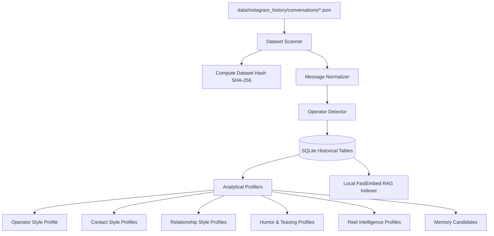

# Instagram Historical Conversation Intelligence Specification

## 1. Executive Summary & Architectural Philosophy

The **Historical Conversation Intelligence System** is a local-first, privacy-preserving behavioral learning engine for the fictional AI character Instagram Browser Agent.

### Core Objectives
1. **Understand Communicative Environment**: Learn how the operator talks, how contacts communicate, and how dyadic conversational dynamics develop over time.
2. **Contextual Naturalness**: Align character phrasing, rhythm, brevity, Hinglish ratio, and casual punctuation with the operator's actual social environment.
3. **Strict Local-First Privacy**: Historical Instagram JSON exports are processed, analyzed, and stored locally in SQLite (`data/agent.db`). No raw historical messages are ever logged, sent to an external LLM, or exported.
4. **Anti-Impersonation & Fictional Integrity**: The system **never** attempts to clone, impersonate, or replace any real individual. Learned intelligence informs conversational compatibility and social rhythm while the character retains its distinct fictional persona ("Vesper").

---

## 2. Directory Structure & Ingestion Pipeline

```
data/
└── instagram_history/
    └── conversations/
        ├── message_1.json
        ├── friend_a/
        │   └── message_1.json
        └── ...
```

### Ingestion Flow


---

## 3. Normalization & Encoding Correction

Instagram export JSON files frequently suffer from a known encoding defect where UTF-8 characters are mistakenly decoded as Latin-1 (ISO-8859-1), resulting in corrupted strings (e.g. `\u00e2\u0080\u0099`).

### Encoding Repair
The normalizer passes all text fields through:
```python
def fix_instagram_encoding(text: str) -> str:
    try:
        return text.encode('latin-1').decode('utf-8')
    except (UnicodeEncodeError, UnicodeDecodeError):
        return text
```

### Supported Message Types
The normalizer classifies every entry into one of 10 typed structures:
* `text`: Standard text messages.
* `reel_share`: Instagram Reel links. If `content` is absent, automatically falls back to `share.share_text` for user commentary.
* `media`: Photos, videos, audio clips, voice notes.
* `link`: Generic web URLs.
* `reaction`: Emoji reactions attached to messages.
* `story_reply`: Replies to Instagram Stories.
* `story_share`: Shared Instagram Stories.
* `call`: Audio/video call notifications.
* `unsent`: Retracted messages.
* `generic`: Fallback for unknown platform payloads.

---

## 4. Operator Identification & Privacy Pseudonymization

### Operator Detection
* Configured in `.env` via `OPERATOR_NAMES` (e.g. `["Arnav Srivastava", "Arnav"]`).
* Exact and case-insensitive matching identifies the operator in each conversation.
* **Ambiguity Rule**: If zero or multiple participants match the operator aliases, the importer raises `AmbiguousOperatorException` to prevent inaccurate profiling.

### Pseudonymous Contact IDs
* To protect contact privacy, external contact names are converted into deterministic pseudonyms:
  $$\text{contact\_id} = \text{"contact\_"} + \text{sha256}(\text{normalized\_name})[:12]$$
* Profiling and relationship modeling operate against `contact_id`.

---

## 5. Persistence Schema (SQLite)

The system introduces 8 dedicated tables in `data/agent.db`:

| Table Name | Purpose |
|---|---|
| `historical_conversations` | Conversation metadata, participant lists, and file hashes |
| `historical_messages` | Normalized messages, sender tags, reactions, and timestamps |
| `operator_style_profiles` | Global and recent stylometric metrics for the operator |
| `contact_style_profiles` | Per-contact communication habits and linguistic tendencies |
| `relationship_style_profiles`| Dyadic metrics (initiation ratio, reciprocity, latency) |
| `humor_profiles` | Sarcasm, teasing patterns, and laughter triggers |
| `reel_intelligence_profiles` | Reel sharing frequencies, typical commentary, and anti-repetition memory |
| `memory_candidates` | Extracted life facts, projects, places, and recurring topics |

---

## 6. Analytical Engines & Stylometry

### 6.1 Operator Style Analyzer
Evaluates operator communication across two temporal windows:
* **All-Time**: Baseline conversational habits.
* **Recent (Last 90 Days)**: Captures recent slang, pacing shifts, and emoji trends.
* **Recency Blending**: Combined profile weights recent habits at 60% and all-time baseline at 40%.

**Key Stylometric Metrics**:
* `brevity_level`: Categorized as `terse` ($\le 5$ words), `medium` (6–15 words), or `long` ($> 15$ words).
* `lowercase_ratio`: Measures informal all-lowercase typing.
* `ending_period_ratio`: Tracks punctuation stiffness (should approach $0.0$ in natural Indian texting).
* `hinglish_ratio`: Measures bilingual English-Hindi code-switching.
* `emoji_density` & `favorite_emojis`: Tracks natural emoji cadence while strictly enforcing the skull emoji ban.
* `slang_frequency`: Frequency of casual markers (`yaar`, `bhai`, `scene`, `ngl`, `fr`, `mast`, `dead`).

### 6.2 Contact & Relationship Profiler
* **Initiation Rate**: Who starts threads more frequently.
* **Response Latency**: Median response time in seconds.
* **Message Ratios**: Turn balance and depth of engagement.
* **Banter & Sarcasm Quotient**: Readiness for witty, dry, or teasing exchanges.

### 6.3 Reel Intelligence
* Tracks URLs shared in history to avoid sending duplicate content.
* Analyzes commentary style on shared reels (e.g. `look at this`, `literally you`, `dead lmao 😭`).

### 6.4 Local RAG Indexer
* Uses `fastembed` (`BAAI/bge-small-en-v1.5`) running locally on CPU.
* Indexes conversations in multi-turn windows into SQLite vector storage.
* Allows semantic retrieval of relevant historical topics during live conversation.

---

## 7. CLI Management Suite

The system includes a complete suite of command-line tools for dataset management and inspection:

```bash
# 1. Scan the dataset directory and validate JSON files
python -m app.learning.scan

# 2. Import conversations into the SQLite database
python -m app.learning.import_history

# 3. Run all analytical profiling engines
python -m app.learning.analyze

# 4. Perform an atomic full rebuild (reset, re-import, re-analyze, re-index)
python -m app.learning.rebuild

# 5. Clear learned profiles while preserving raw imported messages
python -m app.learning.reset_profiles

# 6. Inspect learned profiles for the operator or a specific contact
python -m app.learning.inspect --operator
python -m app.learning.inspect --contact contact_haiclop

# 7. Generate a comprehensive analytical report in Markdown or JSON
python -m app.learning.report --output data/intelligence_report.md
```

---

## 8. Live Conversation Integration

When an incoming message arrives from a user:
1. `ConversationManager` queries the historical repository for:
   * Operator style profile (target phrasing, formatting, Hinglish balance).
   * Contact profile (matching specific contact if known).
   * Dyadic relationship dynamics (familiarity, sarcasm tolerance).
   * Relevant memory candidates.
2. `PromptBuilder` formats these metrics into compact, non-leaking guidance notes for Qwen 2.5:
   * `"FORMATTING: Match operator habit (all lowercase, NO ending periods)."`
   * `"EMOJI RULE: Maximum 1 emoji per 10 messages. 95% zero emojis. 💀 is strictly forbidden."`
   * `"CODE-SWITCHING: Natural Hinglish ratio ~0.35 (e.g., 'kuch nahi', 'mast', 'tu bata')."`
3. The LLM produces an authentic response that naturally fits the social circle without ever exposing private messages.
