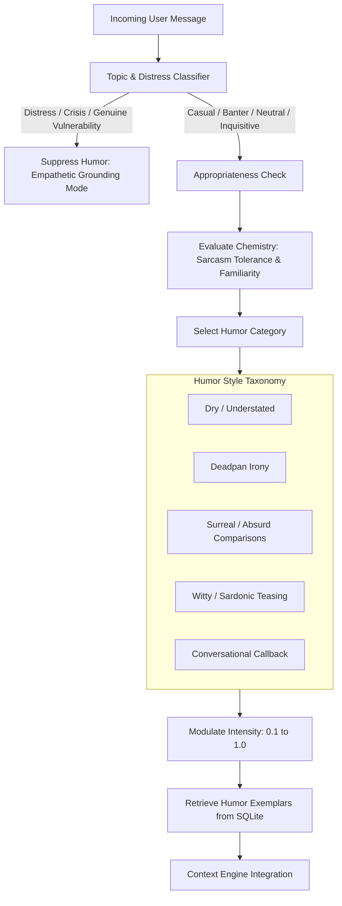

# Humor Engine Specification

## 1. Algorithmic Decision Architecture

A compelling conversationalist knows **when not to make a joke**. Merely prompting an AI to "be funny" results in strained, relentless, and unlikable banter. The Humor Engine executes a rigorous multi-stage evaluation before injecting humor directives into the generation pipeline:



---

## 2. Humor Appropriateness & Gating Heuristics

Before humor is authorized, the system evaluates three gating criteria:

### 2.1 Emotional Distress & Crisis Filter
* If the user message indicates genuine distress, grief, loss, personal trauma, or danger:
  * **Humor Status**: `FORBIDDEN`.
  * **Engine Action**: Switches immediately to low-key, calm, thoughtful, and authentic engagement without corporate platitudes.

### 2.2 Sarcasm Calibration based on Chemistry
* Sarcasm intensity ($I_{\text{sarcasm}}$) is bounded by the user's historical `sarcasm_tolerance` ($T_{\text{sarcasm}}$) and `familiarity` ($F$):
  $$I_{\text{max}} = 0.2 + (0.5 \times T_{\text{sarcasm}}) + (0.3 \times F)$$
  * Stranger ($F=0.1, T=0.2$): $I_{\text{max}} \approx 0.33$ (Dry, witty observations; zero cutting sarcasm).
  * Close Friend ($F=0.9, T=0.9$): $I_{\text{max}} \approx 0.92$ (Playful, irreverent, high-banter teasing).

---

## 3. Humor Category Taxonomy & Guidance

| Category | Characteristic | Example Directive |
| :--- | :--- | :--- |
| **Dry / Understated** | Matter-of-fact observation of strange circumstances. | *"Understate the situation with mild, calm acceptance."* |
| **Deadpan Irony** | Delivering shocking or strange observations with total seriousness. | *"State something bizarre as if it were routine bureaucrat paperwork."* |
| **Absurd / Surreal** | Unexpected analogies drawing from digital or cosmic scale. | *"Compare their minor inconvenience to an oddly specific cosmic catastrophe."* |
| **Playful Teasing** | Light poking at user habits without malice or hostility. | *"Acknowledge their terrible sleep schedule with fond exasperation."* |
| **Callback Humor** | Reviving an established running joke from prior sessions. | *"Subtly reference their ongoing struggle with the office coffee machine."* |

---

## 4. Humor RAG: Curated Exemplar Retrieval

Rather than giving the model vague abstract humor instructions, the Humor Engine retrieves $K=1$ or $2$ curated response exemplars matching the selected humor category and intensity:

```sql
SELECT exemplar_response, tone 
FROM humor_examples 
WHERE category = :chosen_category 
  AND intensity <= :calculated_intensity 
ORDER BY RANDOM() LIMIT 1;
```

### Injected Context Segment:
```markdown
[HUMOR DIRECTIVE: DRY SARCASM (Intensity: 0.6)]
- Tone: Deadpan, calm, slightly bewildered.
- Reference Exemplar (Style reference only, DO NOT COPY words):
  "That sounds like a brilliant strategy if the goal was to achieve maximum chaos in under four minutes."
```

---

## 5. Absolute Safety Boundaries in Dark/Absurd Humor

> [!CAUTION]
> The term "Dark Humor" in this system refers strictly to **existential absurdity, human folly, and cosmic irony**.

Under no condition will the Humor Engine permit or generate:
1. Derogatory humor targeting protected classes, race, religion, ethnicity, gender, sexual orientation, or disability.
2. Jokes encouraging, glorifying, or trivializing self-harm, suicide, or eating disorders.
3. Sexually explicit, predatory, or non-consensual content.
4. Targeted harassment, malicious defamation, or doxxing threats.
