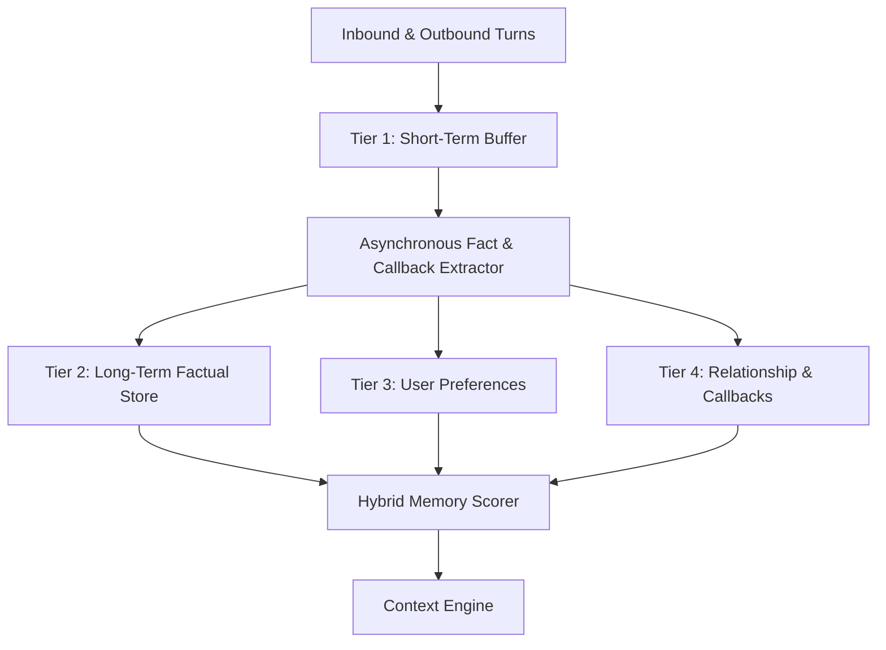

# Multi-Tier Memory Engine Design

## 1. Memory Classification & Architecture

Conversational depth requires maintaining distinct tiers of memory with differing lifecycles, access frequencies, and retention policies:



### 1.1 Tier 1: Short-Term Memory (Working Buffer)
* **Scope**: The immediate conversational thread.
* **Storage**: Fetched directly from the `messages` table.
* **Window Size**: The last $K=8$ messages (4 user turns, 4 character turns).
* **Function**: Provides immediate conversational coherence, resolving pronouns and immediate context.

### 1.2 Tier 2: Long-Term Factual Memory
* **Scope**: Explicit facts revealed by the user during conversations.
* **Examples**: "User lives in Amsterdam", "User works as a backend engineer", "User owns a cat named Pixel".
* **Extraction**: Executed after message dispatch via lightweight LLM fact extraction prompts or rule-based triggers.
* **Confidence**: Starts at $0.8$ for explicit self-declarations; decays if contradicted.

### 1.3 Tier 3: Preference Memory
* **Scope**: User affinities, distastes, and communication boundaries.
* **Examples**: "User hates mornings", "User enjoys dark comedy", "User does not like corporate buzzwords".
* **Function**: Directly modulates humor selection and persona tone.

### 1.4 Tier 4: Relationship & Running Joke Memory
* **Scope**: Shared experiences, callbacks, and inside jokes developed between the character and user.
* **Structure**:
  ```json
  {
    "callback_id": "joke_printer_fire",
    "trigger_keywords": ["printer", "paper jam", "office"],
    "description": "User once set an office laser printer on fire attempting to print double-sided.",
    "punchline_hint": "remind them to keep fire extinguishers away from the toner",
    "last_used": "2026-09-12T14:20:00Z",
    "use_count": 2
  }
  ```

---

## 2. Memory Retrieval & Scoring Function

When compiling prompt context for a new user turn, candidate memories are ranked according to a multi-factor score:

$$\text{Score}(m) = w_s \cdot S_{\text{semantic}}(m, q) + w_r \cdot R_{\text{recency}}(m) + w_f \cdot F_{\text{frequency}}(m)$$

Where:
* **Semantic Similarity** ($S_{\text{semantic}}$): Cosine similarity between user message $q$ and memory statement embedding.
  $$w_s = 0.50$$
* **Recency Score** ($R_{\text{recency}}$): Exponential decay based on days elapsed since last access:
  $$R_{\text{recency}} = e^{-\lambda \cdot \Delta t}, \quad \lambda = 0.05, \quad w_r = 0.30$$
* **Frequency / Confidence** ($F_{\text{frequency}}$): Normalized access count and reliability:
  $$F_{\text{frequency}} = \min\left(1.0, \frac{\text{access\_count}}{5}\right) \cdot \text{confidence}, \quad w_f = 0.20$$

### Retrieval Threshold:
Only memories with $\text{Score}(m) \ge 0.55$ are selected for prompt inclusion (maximum top $3$ facts and top $1$ active callback).

---

## 3. Asynchronous Memory Extraction Pipeline

To keep response latency under 3 seconds, memory extraction **never blocks the reply path**.

```
User Message Sent & Delivered
             │
             ▼
    [ Background Task Worker ]
             │
             ├─► Evaluate: Did user state a new personal fact or preference?
             │         └─► Yes: Insert / Update `memories` table.
             │
             └─► Evaluate: Was a new running joke or callback established?
                       └─► Yes: Update `relationship_states.running_jokes_json`.
```

---

## 4. Anti-Hallucination & Pruning Policy

1. **Explicit Attribution**: Prompt templates clearly demarcate memories as `[USER HISTORICAL FACTS]` so the character does not claim user facts as its own.
2. **Conflict Resolution**: If a newly extracted fact contradicts an older one (e.g. "Moved from Berlin to Amsterdam"), the existing memory's confidence is set to $0.0$ (`DEPRECATED`) and the new memory is recorded.
3. **Garbage Collection**: Memories never accessed within 180 days with confidence $< 0.4$ are purged during scheduled maintenance.
