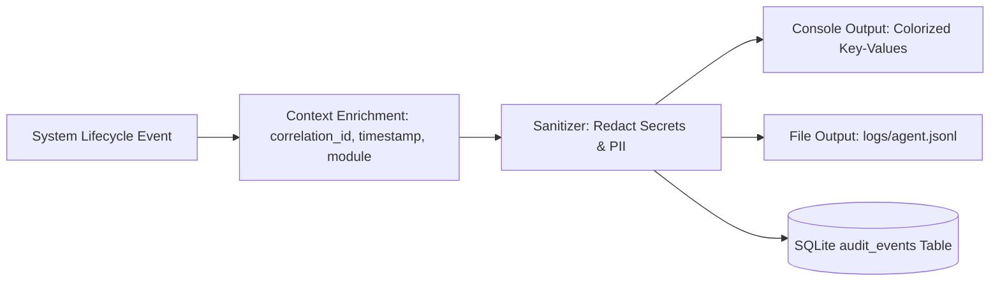

# Observability & Structured Logging Specification

## 1. Structured Logging Architecture

The application standardizes on `structlog` to emit JSON-formatted, machine-readable log streams. Every asynchronous message handling task generates and carries a unique `correlation_id` (UUID4) bound to logger context across all subsystem boundaries.



---

## 2. Standardized Log Event Taxonomy

| Event Key | Level | Parameters | Description |
| :--- | :--- | :--- | :--- |
| `browser.started` | INFO | `headless`, `viewport`, `user_data_dir` | Browser process initialized. |
| `instagram.session_loaded` | INFO | `authenticated`, `profile_path` | Session cookies loaded from profile. |
| `message.detected` | INFO | `correlation_id`, `sender_handle`, `fingerprint` | Inbound DM extracted from DOM. |
| `conversation.loaded` | INFO | `correlation_id`, `turn_count`, `familiarity` | SQLite conversation history loaded. |
| `memory.retrieval_complete`| INFO | `correlation_id`, `facts_count`, `duration_ms` | Memory scoring completed. |
| `rag.retrieval_complete` | INFO | `correlation_id`, `chunks_count`, `duration_ms` | Vector search completed. |
| `llm.request_started` | INFO | `correlation_id`, `provider`, `model`, `prompt_tokens`| LLM generation initiated. |
| `llm.response_received` | INFO | `correlation_id`, `output_tokens`, `duration_ms`| Response returned by provider. |
| `response.validated` | INFO | `correlation_id`, `passed`, `validator_checks` | Output guardrails evaluated. |
| `response.sent` | INFO | `correlation_id`, `recipient`, `duration_ms` | Response successfully dispatched via DOM. |
| `challenge.detected` | CRITICAL | `url`, `screenshot_path` | Anti-automation checkpoint encountered. |

---

## 3. Sample Structured Log Payloads

```json
{
  "timestamp": "2026-09-18T01:40:15.124Z",
  "level": "info",
  "event": "message.detected",
  "correlation_id": "c7a82b90-1c39-4d6e-9e7f-b2a1985c49a1",
  "component": "browser",
  "sender_handle": "@alex_dev",
  "fingerprint": "8f3b...19c",
  "message_length": 28
}
```

```json
{
  "timestamp": "2026-09-18T01:40:17.842Z",
  "level": "info",
  "event": "response.sent",
  "correlation_id": "c7a82b90-1c39-4d6e-9e7f-b2a1985c49a1",
  "component": "conversation",
  "recipient": "@alex_dev",
  "humor_style": "dry_sarcasm",
  "metrics": {
    "detection_latency_ms": 120,
    "retrieval_latency_ms": 18,
    "llm_latency_ms": 1420,
    "browser_send_latency_ms": 860,
    "total_latency_ms": 2418
  }
}
```

---

## 4. Latency Telemetry & Performance Budgets

To keep conversation naturally fluid without hitting platform rate limits, the system instruments key latency intervals:

* **Detection Latency**: Time elapsed from DOM message node appearance to message extraction ($\le 250\text{ms}$).
* **Cognitive Retrieval Latency**: Time for SQLite facts, Style calculation, and Local RAG search combined ($\le 100\text{ms}$).
* **LLM Generation Latency**: Time from API dispatch to response token completion ($\le 2500\text{ms}$).
* **Typing & DOM Dispatch**: Human-like keystroke execution ($\approx 500\text{ms} - 1500\text{ms}$).
* **Target Total Response Latency**: **$2.0\text{s} - 4.5\text{s}$**.

---

## 5. Sensitive Content Redaction & Privacy

When running in production or shared environments, operators can toggle `LOG_SANITIZE_MESSAGES=true` in `.env`:
* Message text fields in logs are replaced by SHA-256 hashes and token length metrics.
* Handles are masked (e.g. `@j***e`).
* API keys and authorization headers are globally scrubbed via custom `structlog` processors before output.
