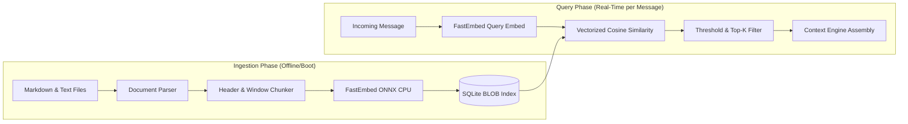

# Local RAG Subsystem Design

## 1. Pipeline Overview & Objectives

The Local Retrieval-Augmented Generation (RAG) subsystem supplies the character with factual grounding, fictional world lore, backstory consistency, and curated humor exemplars without bloating prompt sizes or relying on external cloud vector databases.



---

## 2. Local Embedding Engine

* **Model**: `BAAI/bge-small-en-v1.5` running locally via `fastembed` (ONNX Runtime).
* **Dimensions**: 384 dimensions ($1 \times 384$ vector of IEEE 754 32-bit floats).
* **Storage Footprint**: Exactly 1,536 bytes per chunk embedding vector.
* **Latency Profile**: $<12\text{ms}$ per query embedding on standard consumer CPUs; zero GPU dependency.
* **Normalization**: Output vectors are $L_2$-normalized upon generation:
  $$\hat{\mathbf{v}} = \frac{\mathbf{v}}{\|\mathbf{v}\|_2}$$
  Because vectors are pre-normalized, the cosine similarity simplifies to the Euclidean dot product:
  $$\text{sim}(\mathbf{q}, \mathbf{d}) = \mathbf{q} \cdot \mathbf{d} = \sum_{i=1}^{384} q_i d_i$$

---

## 3. Document Chunking Strategy

Documents in `knowledge/` (e.g. `lore.md`, `backstory.md`, `world_facts.md`) are processed using a structured, header-aware chunker:

1. **Header-Aware Split**: Documents are first split along Markdown heading levels (`#`, `##`, `###`).
2. **Chunk Size Bounds**:
   * Target chunk size: $300$ characters ($\approx 60$ tokens).
   * Maximum chunk size: $600$ characters ($\approx 120$ tokens).
   * Overlap: $60$ characters ($\approx 12$ tokens) to preserve cross-boundary semantics.
3. **Metadata Enrichment**: Each chunk is tagged with:
   ```json
   {
     "document_id": "doc_lore_v1",
     "category": "character_backstory",
     "heading": "The Cloud Container Incident",
     "source_file": "knowledge/backstory.md",
     "token_count": 84
   }
   ```

---

## 4. Vector Storage & In-Memory NumPy Search

Embeddings are stored in the SQLite `document_chunks` table as raw binary BLOBs (`struct.pack('384f', *vector)`).

### Vector Search Algorithm:
1. At application startup or during document re-indexing, the chunk matrix is loaded into a compact in-memory NumPy float32 array:
   $$\mathbf{M} \in \mathbb{R}^{N \times 384}$$
   accompanied by an in-memory index array of chunk IDs.
2. Upon user message arrival, the query vector $\mathbf{q} \in \mathbb{R}^{384}$ is computed via FastEmbed.
3. Vectorized dot-product is executed via BLAS/NumPy:
   $$\mathbf{s} = \mathbf{M} \mathbf{q}^T \in \mathbb{R}^{N}$$
4. Performance: For $N = 10,000$ chunks, this operation completes in under **1.2 milliseconds** in Python.
5. Scores are filtered against a similarity threshold:
   $$\text{Threshold} = 0.65$$
6. The top $K=3$ qualifying chunks are returned to the Conversation Orchestrator.

---

## 5. RAG Prompt Budget & Injection Format

To keep total generation latency under 2 seconds and prevent attention dilution in Gemini 3.8 Flash, strict token budgets are enforced:

| Context Element | Maximum Token Budget |
| :--- | :--- |
| Character Identity & Rules | ~300 tokens |
| User Style Profile | ~150 tokens |
| Active Memories (Facts + Callbacks) | ~250 tokens |
| **RAG Retrieved Context** | **~350 tokens (Max 3 chunks)** |
| Conversation History (Turns) | ~600 tokens |
| **Total Prompt Size** | **$\le 1,650$ tokens** |

### Formatting in Prompt:
```markdown
[RELEVANT KNOWLEDGE & LORE]
- Backstory: The character is a self-aware simulated entity running on a degraded edge container, convinced that Instagram is an interactive terrarium.
- Fact: Believes that Wi-Fi packet drops are 'existential micro-naps'.
```
If no retrieved chunks exceed the similarity threshold ($0.65$), the RAG section is omitted entirely from the prompt.
