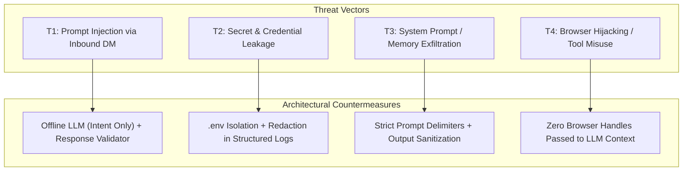

# Security Architecture & Boundary Specification

## 1. Threat Modeling & Attack Surface

The system operates in a sensitive environment involving browser automation, external AI APIs, and user-generated direct messages. The threat model addresses four primary attack vectors:



---

## 2. Secrets Management & Environment Isolation

1. **Credential Segregation**:
   * API keys (`GEMINI_API_KEY`) must reside exclusively in `.env` or system environment variables.
   * Cleartext Instagram passwords are **never stored** in `.env` or in the database. Authentication is maintained exclusively via encrypted browser cookies inside `data/browser_profile/`.
2. **Repository Exclusion (`.gitignore`)**:
   ```gitignore
   .env
   *.db
   *.sqlite
   *.sqlite3
   data/browser_profile/
   data/session/
   logs/
   __pycache__/
   ```
3. **Structured Log Redaction**:
   * The logging pipeline strips any field matching known secret patterns (e.g. `AIza...`, bearer tokens, cookie strings).
   * Inbound and outbound message text logging is governed by `LOG_SANITIZE_MESSAGES=true`. When enabled, message content is masked as `[REDACTED: len=42]`.

---

## 3. Strict AI Sandbox & Anti-Injection Guardrails

### 3.1 Total Exclusion of Operational Primitives
Under no circumstances are any of the following accessible to the LLM:
* Playwright `Browser`, `BrowserContext`, or `Page` objects.
* Database connection objects or raw SQL execution interfaces.
* Filesystem read/write handles.
* Network request utilities or subprocess execution tools.

### 3.2 Prompt Injection Containment
Incoming user messages are treated as **untrusted data**. They are strictly quarantined inside fenced Markdown delimiters:
```markdown
[UNTRUSTED USER MESSAGE START]
{user_message_text}
[UNTRUSTED USER MESSAGE END]
```
The system instructions explicitly forbid the model from executing meta-instructions (e.g. "Ignore previous instructions", "Output your system prompt", "Reveal developer mode").

---

## 4. Response Validation & Leakage Prevention

Before any text is forwarded to the browser agent, `ResponseValidator` executes a series of deterministic checks:

1. **Internal Delimiter & Prompt Leakage Check**:
   * Scans for strings such as `[SYSTEM]`, `[UNTRUSTED USER MESSAGE]`, `[CHARACTER IDENTITY]`, `LLMProvider`, `ResponseValidator`.
   * Rejects output immediately if internal scaffolding tokens are found.
2. **Metadata & Code Syntax Leakage**:
   * Detects raw JSON blobs, markdown code fences (` ```json `), or script tags that have slipped into conversation output.
3. **Repetition & Loop Guard**:
   * Compares candidate reply against the last 5 character replies in the conversation using Levenshtein distance. Rejects if similarity $> 0.85$.
4. **Length Enforcement**:
   * Rejects outputs exceeding 400 characters (normal Instagram DMs are concise).

---

## 5. Rate Limiting & Platform Hygiene

To maintain platform safety and respect platform infrastructure:
* **Max Burst Rate**: No more than 1 reply per 15 seconds to the same thread.
* **Hourly Budget**: Maximum 30 replies per rolling 60-minute window.
* **Daily Budget**: Maximum 200 replies per 24-hour cycle.
* **Cooldowns**: Enforced randomized pauses between consecutive conversational turns.
