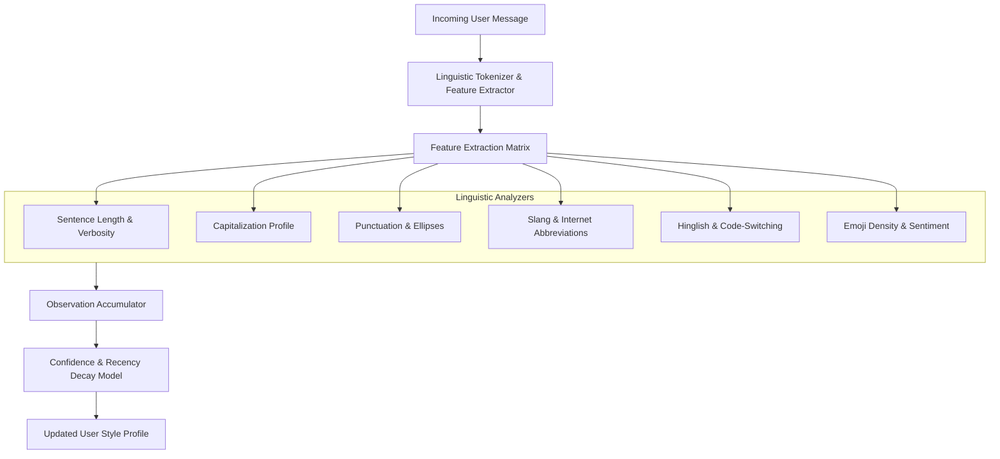

# User Style Learning Subsystem Specification

## 1. Objective & Stylistic Philosophy

The Style Learning engine enables the character to organically adapt its communication cadence, vocabulary, and structural habits to match each user's unique rhythm. 

> [!IMPORTANT]
> **Core Principle: Subtle Resonance, Not Mimicry.**
> The character must never become a parody or an exact mirror of the user. If the user uses slang, the character warms to informal phrasing while preserving its own sardonic, distinctive voice.

---

## 2. Stylometric Observation Pipeline



---

## 3. Stylometric Features & Extraction Heuristics

### 3.1 Sentence Length & Verbosity
* **Metric**: Average words per message turn:
  $$\bar{L}_{t} = \alpha \cdot L_{\text{current}} + (1 - \alpha) \cdot \bar{L}_{t-1}, \quad \alpha = 0.25$$
* **Classification**:
  * `terse`: $\le 5$ words ("k", "sure", "whats up")
  * `conversational`: $6 - 25$ words
  * `verbose`: $> 25$ words

### 3.2 Capitalization Profile
* **Heuristic**: Evaluates the ratio of lowercase-to-uppercase characters and leading sentence capitalization:
  * `all_lowercase`: $>95\%$ lowercase with no initial caps ("hey man whats going on").
  * `standard`: Proper initial capitalization and punctuation.
  * `shouting_emphasis`: Frequent full-caps token bursts ("NO WAY REALLY").

### 3.3 Punctuation & Boundary Markers
* **Features**:
  * Trailing ellipses (`...`): Signifies trailing thoughts or dry sarcasm.
  * Absence of terminating punctuation (`.` omitted): Common in mobile chat.
  * Multiple exclamation/question marks (`??`, `!!`): Heightened emotional state.

### 3.4 Slang, Vernacular & Internet Abbreviations
* Lexicon matching against high-frequency informal registers:
  * Slang terms: `ngl`, `tbh`, `fr`, `cap`, `lowkey`, `idk`, `rn`, `lmao`, `ded`, `bruh`, `bro`.
  * Tracked as a frequency map in `style_profiles.slang_vocabulary_json`.

### 3.5 Language Mixing & Hinglish Detection
* Detects code-switching between English and Hindi/Urdu romanized vernacular:
  * Markers: `yaar`, `arre`, `bhai`, `sahi hai`, `kya`, `chal`, `matlab`, `funda`, `scene`, `batao`.
  * Confidence is elevated when vernacular words accompany conversational English ("bro what is the scene yaar").

### 3.6 Emoji Density
* **Metric**: Total emoji count divided by total word count.
  * `zero`: Exactly 0 emojis over multiple turns.
  * `sparing`: 1 emoji per 2-3 messages.
  * `frequent`: $\ge 1$ emoji per message turn.

---

## 4. Confidence Scoring & Evidence Accumulation

A stylistic trait is never adopted on a single isolated observation. Each trait $T$ maintains statistical evidence:

$$\text{Confidence}(T) = \min\left(1.0, \frac{N_{\text{evidence}}}{N_{\text{threshold}}}\right) \times \left(1.0 - \text{ContradictionPenalty}\right) \times e^{-\gamma \cdot \Delta t}$$

* $N_{\text{threshold}} = 4$ observations required for full confidence ($1.0$).
* **Example Progression**:
  * Observation 1 ("bro"): $N=1, \text{Conf} = 0.25$ (Weak signal $\to$ character does not adopt).
  * Observation 2 ("bro why"): $N=2, \text{Conf} = 0.50$ (Emerging pattern).
  * Observation 3 ("yo bro"): $N=3, \text{Conf} = 0.75$ (Consistent trait).
  * Observation 4 ("bro fr"): $N=4, \text{Conf} = 1.00$ (High-confidence trait $\to$ character incorporates casual informal register).

---

## 5. Style Projection into Prompt Context

The synthesized profile is converted into targeted, non-obtrusive guidance in the character prompt:

```markdown
[USER COMMUNICATION STYLE ADAPTATION]
- Formality: Very low (user writes in terse lowercase sentences).
- Vocabulary notes: Comfortable with casual slang ('bro', 'lowkey').
- Hinglish: Moderate usage detected ('yaar', 'scene').
- Guidance: Match their brevity and casual posture. Keep your response under 15 words. Do not force slang unnaturally. Preserve your deadpan sarcasm.
```
