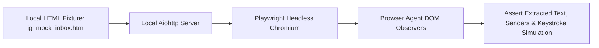

# Testing Strategy & Quality Assurance Specification

## 1. Multi-Tier Testing Pyramid

The project employs a three-tier testing strategy ensuring cognitive determinism, data integrity, and safe browser automation. All tests execute via `pytest` and `pytest-asyncio`.

```
                    ┌─────────────────────────┐
                    │    Failure Injection    │  (Fault injection, 429s, DOM drops)
                    ├─────────────────────────┤
                    │   Browser Mock Tests    │  (Mock DOM Instagram fixtures)
                    ├─────────────────────────┤
                    │   Integration Testing   │  (SQLite, Local RAG, Repositories)
                    ├─────────────────────────┤
                    │      Unit Testing       │  (Style, Memory, Humor, Prompts, Validator)
                    └─────────────────────────┘
```

---

## 2. Unit Testing Scope (`tests/unit/`)

Unit tests isolate algorithmic components without network calls or browser dependencies:

| Module Under Test | Test File | Target Invariants |
| :--- | :--- | :--- |
| **Config Loader** | `test_config.py` | Validates YAML parsing, Pydantic type conversions, default fallbacks, and env override priority. |
| **Prompt Builder** | `test_prompts.py` | Verifies deterministic prompt output, token budget bounds, and proper delimiter fencing. |
| **Style Analyzer** | `test_style.py` | Tests sentence length, slang mapping, Hinglish detection, and evidence accumulation formulas. |
| **Memory Scorer** | `test_memory.py` | Verifies mathematical scoring function ($w_s, w_r, w_f$), recency decay, and threshold filtering. |
| **Local RAG** | `test_rag.py` | Tests markdown header splitting, chunk overlap preservation, and vector similarity metrics. |
| **Humor Engine** | `test_humor.py` | Verifies crisis suppression, sarcasm intensity calibration against chemistry, and exemplar lookup. |
| **Response Validator** | `test_validator.py`| Ensures rejection of prompt leaks, raw JSON, repetitive phrases, and excessive message length. |
| **State Machine** | `test_state.py` | Tests message status progression (`RECEIVED -> PROCESSING -> SENT/FAILED`). |

---

## 3. Integration Testing Scope (`tests/integration/`)

Integration tests verify multi-component contracts against local runtime resources:

1. **SQLite Database & Repositories (`test_database.py`)**:
   * Verifies WAL mode execution and foreign key enforcement.
   * Tests concurrent read/write isolation and duplicate fingerprint collision handling (`sqlite3.IntegrityError`).
2. **Local RAG End-to-End (`test_rag_pipeline.py`)**:
   * Indexes sample markdown lore files using local FastEmbed ONNX model.
   * Queries index with synthetic queries, verifying top-$K$ accuracy and retrieval latency $<25\text{ms}$.
3. **Conversation Orchestrator Pipeline (`test_orchestration.py`)**:
   * Employs `MockLLMProvider` returning pre-baked structured JSON responses.
   * Tests complete flow: message ingestion $\to$ context building $\to$ mock LLM generation $\to$ validation $\to$ persistence.

---

## 4. Controlled Browser Mock Testing (`tests/browser/`)

To avoid unstable testing against live Instagram accounts during CI/CD, the browser suite uses **local HTTP static fixtures** mimicking the Instagram Direct DOM:



* **Test Scenarios**:
  * `test_message_detection`: Verifies that new DOM child elements trigger extraction events.
  * `test_duplicate_prevention`: Ensures re-rendering existing messages does not emit duplicates.
  * `test_keystroke_typing`: Verifies simulated input events and Enter dispatch into `contenteditable` inputs.
  * `test_checkpoint_detection`: Injects mock checkpoint HTML and verifies immediate halt triggers and screenshot generation.

---

## 5. Failure Injection & Resilience Suite (`tests/integration/test_fault_injection.py`)

Validates system behavior under degraded conditions:

* **Fault 1: LLM 429 Rate Limit**: Simulates HTTP 429 status code. Verifies exponential backoff with jitter and retry cap.
* **Fault 2: Malformed Output**: Injects unparseable JSON or truncated strings. Verifies retry or graceful suppression.
* **Fault 3: Prompt Leak Candidate**: Injects candidate reply containing `[SYSTEM]` tags. Verifies validator rejection.
* **Fault 4: Database Busy**: Simulates table locks. Verifies `busy_timeout` handling without data corruption.
* **Fault 5: Browser Crash**: Force-terminates Chromium child process. Verifies safe clean-up of profile locks.

---

## 6. Routine & Availability Verification Suite (`tests/integration/test_availability_flow.py`)

* **Scenario 1: Canonical Time-Slot Resolution**:
  * Asserts correct availability resolution across hours: Monday 10:00 (`AT_SCHOOL`), 17:30 (`AT_TUITION`), 23:45 (`SLEEPING`).
* **Scenario 2: Special Event Overrides**:
  * Asserts holiday overrides school schedule; exam schedule injects high stress and study blocks.
* **Scenario 3: Imminent Departure Warning**:
  * Asserts warning window trigger 15 minutes before activity start.
* **Scenario 4: Natural Departure & Silent Queueing**:
  * Asserts departure goodbye generated when tuition starts; sets `away_until`; subsequent messages during away period are saved in `RECEIVED` state without LLM generation.
* **Scenario 5: Batch Return from Away**:
  * Asserts that when character becomes available at 19:00, all queued messages are processed in a single conversational turn without generating spammy individual replies.
